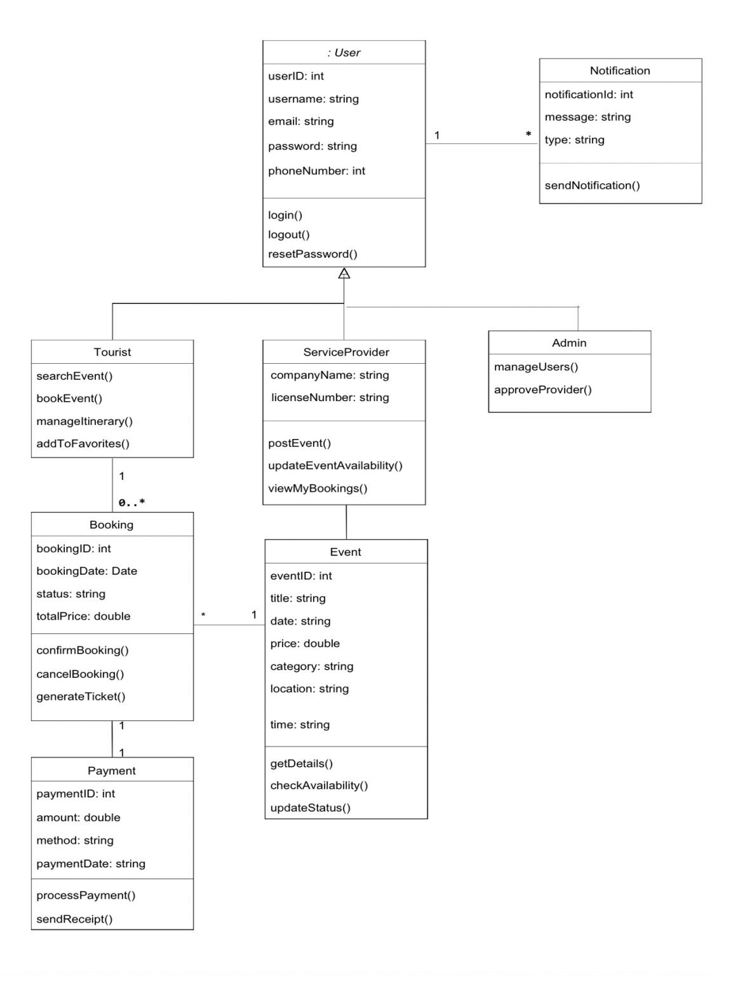

<p align="center">

# Tour & Event Planner System

### Software Engineering Team Project

College of Computer Science and Engineering  
University of Ha'il

</p>

---

<p align="center">

Requirements Engineering • UML Modeling • System Analysis • System Design

</p>

---

## Project Overview

The **Tour & Event Planner System** is a collaborative Software Engineering project that focuses on the analysis and design of a tourism event planning platform.

The proposed system aims to provide tourists with a centralized platform for discovering tourism events, exploring attractions, booking activities, and managing their travel experience while allowing service providers to publish and manage events.

This project was developed as part of the **CSCE 232 – Software Engineering** course at the **University of Ha'il**.

---

## Project Objectives

- Analyze stakeholder requirements.
- Identify functional and non-functional requirements.
- Produce a complete Software Requirements Specification (SRS).
- Design the proposed system using UML diagrams.
- Apply Software Engineering principles throughout the analysis and design phases.

---

## Project Scope

This repository documents the **analysis and design phases** of the Software Development Life Cycle (SDLC).

It does **not** contain source code implementation. Instead, it includes the documentation and design artifacts produced before software development begins.

---

## Repository Structure

```text
Tour-Event-Planner-System
│
├── README.md
├── LICENSE
├── .gitignore
│
├── docs
│   └── Final-Report.pdf
│
├── diagrams
│   ├── Class-Diagram.JPG
│   ├── Use-Case-Diagram.JPG
│   └── System-Sequence-Diagram.JPG
│
└── images
    └── UI-Design.JPG
```

---

## Project Documentation

- Software Requirements Specification (SRS)
- Stakeholder Analysis
- Functional Requirements
- Non-Functional Requirements
- Fully Dressed Use Cases
- User Interface Design

---

## UML Diagrams

### Use Case Diagram


---

### Class Diagram



---

### System Sequence Diagram


---

## User Interface


---

## Technologies & Concepts

- Software Engineering
- Requirements Engineering
- UML Modeling
- System Analysis
- System Design
- Software Development Life Cycle (SDLC)

---

## Team Members

- Wasan Algharbi
- Haifa Alfawzan
- Fajr Albayih
- Jana Aljuhani
- Sarah Alamer

---

## Academic Information

**Course:** CSCE 232 – Software Engineering

**University:** University of Ha'il

**College:** College of Computer Science and Engineering

---

## Academic Purpose

This repository demonstrates the application of Software Engineering principles, requirements engineering, and UML modeling techniques through a collaborative university project. It is published for educational and portfolio purposes.
